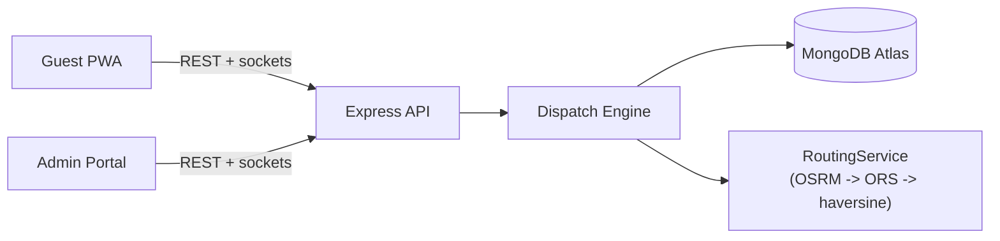

# EventRide — Smart Cab / Vehicle Dispatch System

Fully automated ride dispatch for a single private event: a fixed, pre-registered fleet serving hundreds of guests moving between an airport/railway station, several accommodations, and one venue across arrival, event, and departure phases. No guest or driver ever picks the other — matching is 100% automatic (see the automation boundary in [`DESIGN.md`](./DESIGN.md)).

**Live URLs:**
- **Backend (Render):** [https://smart-cab-dispatch-system.onrender.com](https://smart-cab-dispatch-system.onrender.com) — health check `/api/health`
- **Guest App (Vercel):** [https://smart-cab-dispatch-system-guest.vercel.app](https://smart-cab-dispatch-system-guest.vercel.app)
- **Admin App (Vercel):** [https://smart-cab-dispatch-system-admin.vercel.app](https://smart-cab-dispatch-system-admin.vercel.app)
**Demo video:** _add Loom link — script in [`docs/DEMO_SCRIPT.md`](./docs/DEMO_SCRIPT.md)._

### Demo credentials

Generated fresh by `npm run seed`, which prints the full table — the ones below are illustrative, always prefer what your own seed run prints.

| Role | Login |
|---|---|
| Admin | `admin@sahyadri.events` / `Admin@1234` |
| Driver | any seeded phone number / `Driver@1234` |
| Guest | booking ref e.g. `EVT-1001` + the matching phone number |

---

## Features by role

**Guest (PWA, `apps/guest`)** — installable mobile app. See arrival details, a live "finding your driver" state, driver name + vehicle number + ETA once assigned, a live tracking map, ride history, and an on-demand request flow with an explicit pending-approval stepper. Never sees or picks a driver.

**Admin (`apps/admin`, admin role)** — ops dashboard with live KPIs and map, approval inbox, queue monitor with priority scores and starvation warnings, a Dispatch Console that visualizes the cost-matrix heatmap and every weight in the objective function, driver/guest management (including CSV import), analytics, and full audit logging on every mutation.

**Driver (`apps/admin`, driver role, `/driver` only)** — one screen, one primary action at a time: accept/reject an offer (with a countdown), arrive, board, drop. No visibility into any other trip, driver, or guest.

---

## Interface, theming & accessibility

Both apps ship a **light/dark theme** that follows the OS by default and remembers an explicit choice per app (`localStorage`). Every neutral resolves through a CSS-variable token (`--c-canvas` / `--c-surface` / `--c-elevated` / `--c-line` / `--c-ink` / `--c-muted` / `--c-faint`), so switching themes is one class on `<html>` rather than a `dark:` variant on every element. An inline bootstrap script in each `index.html` applies the stored theme **before first paint**, so a dark-mode user never sees a white flash on load. The toggle is reachable from the admin sidebar, the driver header, the guest Profile screen, **and both login screens** — a user who prefers dark shouldn't have to sign in through a bright one. OpenStreetMap ships no dark raster tiles, so the dark basemap is produced by inverting the tile pane only, leaving markers and route polylines their true colours.

Other interface behaviour worth knowing:

- **Destructive and session-ending actions confirm first.** Logging out opens a dialog in all three roles; the driver's copy is context-aware and warns when a trip is still in progress.
- **Sessions that expire explain themselves.** A 401 on an authenticated call bounces the user to the login screen *with a notice*, instead of silently presenting an empty form. A 401 on the login call itself carries no token and is treated as a wrong password, not an expiry.
- **Offline is stated, not implied.** Both apps show a banner when the browser loses its network, so frozen figures read as "no connection" rather than "the app is broken". `navigator.onLine` drives the banner only — never request gating, since it reports a link, not a reachable API.
- **Dialogs are real dialogs**: `role="dialog"` + `aria-modal`, focus moved into the panel and restored to the trigger on close, a Tab focus trap, Escape to dismiss, and background scroll locked (which also stops the page sliding under a thumb on iOS).
- **Motion is optional.** `prefers-reduced-motion: reduce` disables the dialog transitions and the live-marker pulse; nothing in either app is conveyed by motion alone.
- Keyboard support throughout: a skip-to-content link past the admin's ten nav links, and visible `focus-visible` rings on every interactive control.

### The sign-in treatment

Both login screens use a drifting **aurora** backdrop (three blurred gradient blobs over a noise layer) behind a **frosted-glass** card that **tilts in 3D toward the pointer**, with a sheen that tracks it. Three deliberate constraints keep it from becoming a liability:

- **Scoped to sign-in only.** Ops screens are read for hours and the guest app is used while walking out of an airport; a moving backdrop behind a live cost matrix or a tracking map is a distraction and a battery cost. Sign-in is the one surface with nothing time-critical on it.
- **It costs nothing to render.** Only `transform` and `opacity` animate, so the whole effect stays on the compositor and never triggers layout or paint. Tilt values are written straight to CSS custom properties on the node — a `setState` per `pointermove` would re-render the sign-in form at pointer frequency — and are coalesced to one write per animation frame. Touch pointers are ignored entirely, so phones pay nothing for the tilt.
- **It degrades honestly.** `prefers-reduced-motion` stops the drift and the tilt while keeping the colour. Browsers without `backdrop-filter` get a near-opaque panel via `@supports not`, so the card is never an unreadable smear. A noise layer sits over the gradients because large low-contrast gradients band visibly on 8-bit panels, and in dark mode the blobs blend with `screen` so they stay luminous instead of muddying to grey where they overlap.

---

## Architecture



| Layer | Tech |
|---|---|
| Backend | Node 20, Express 4, TypeScript, Mongoose 8, Socket.IO 4 |
| Matching | Hungarian algorithm (`munkres-js`), custom cost function, hard feasibility mask |
| Database | MongoDB Atlas M0 (free) |
| Routing | OSRM public demo → OpenRouteService → haversine fallback chain |
| Frontends | React 18 + Vite + Tailwind, `react-leaflet` maps, PWA via `vite-plugin-pwa` |
| Realtime | Socket.IO, JWT-authenticated, room-scoped (`admin`, `driver:<id>`, `guest:<id>`, `trip:<id>`) |
| AI (optional) | Gemini — read-only ops assist, disabled cleanly when unconfigured |
| Hosting | Render (backend) + two Vercel projects (guest/admin frontends) |

The dispatch algorithm, every cost weight, and every trade-off are documented in depth in **[`DESIGN.md`](./DESIGN.md)** — read that for the "how" and "why," not this file.

---

## Local setup

Prerequisites: Node `>=20.11 <23`, npm, a MongoDB Atlas connection string (free M0 tier is fine).

```bash
git clone <this repo>
cd smart-cab-dispatch-system
npm i

# Server env — edit MONGODB_URI to your own Atlas cluster
cp .env.example apps/server/.env

npm run seed         # idempotent — fills in what's missing, prints a credentials table
npm run dev          # server :4000, guest :5173, admin :5174
```

`apps/guest/.env` and `apps/admin/.env` already point at `http://localhost:4000` for local dev — no changes needed unless you move the backend port.

To wipe and re-seed from scratch:
```bash
npm run seed:fresh
```
> **Windows/PowerShell note:** `npm run <script> -- <args>` does not reliably forward the trailing args through a workspace script on some npm/PowerShell combinations (confirmed on npm 10.9.2 + PowerShell — works fine in Git Bash). That's why `--fresh` is its own dedicated script (`seed:fresh`) rather than a forwarded flag. If you ever need to pass ad-hoc CLI args to a workspace script and `--` isn't forwarding, run it directly instead: `cd apps/server && npx tsx <script> <args>`.

Run the test suite (unit + integration, `mongodb-memory-server`, no external dependency):
```bash
npm test -w server
```

Run the peak-arrival load test (boots the real server in-process and drives it over real HTTP — see `apps/server/src/sim/simulate.ts`). The defaults already match the scenario below, so no arguments are needed:
```bash
npm run simulate
```
To run it at a different scale, invoke it directly (see the Windows note above):
```bash
cd apps/server && npx tsx src/sim/simulate.ts --drivers 60 --guests 250 --burst 90 --minutes 20 --speed 30x
```
**Either form wipes and re-seeds the Driver/Guest/Trip/QueueEntry/Alert collections** — run `npm run seed:fresh` afterward to restore the demo dataset before recording anything.

---

## Matching algorithm — short version

Three strategies per tick, in order of least to most disruptive: **detour insertion** (slot a new pickup into a driver already moving), **batch Hungarian assignment** (globally optimal for the rest, after clustering compatible demand into shared rides), **greedy real-time matching** (stragglers, and the path used between ticks). A superlinear wait-time term plus a hard starvation-sweep pre-emption rule guarantee no guest waits indefinitely; capacity is a hard constraint (`BIG_M` in the cost matrix, never a soft penalty), never violated. Full derivation, every weight, and the anti-starvation arithmetic: **[`DESIGN.md`](./DESIGN.md)**.

---

## Peak-arrival simulation report

Run against the real backend (real Express + Socket.IO process, real MongoDB Atlas, real driver accept/reject/board/drop over real HTTP) — `npm run simulate` (defaults already match this scenario):

```
── PEAK ARRIVAL SIMULATION REPORT ──────────────────────
Guests                     250      Trips created        61
Matched                    97      Shared rides          14 (23%)
Unassignable                 0      Detour insertions     0

Wait time      avg  1.2m   p50  1.8m   p95  2.2m   max  2.2m
Match latency  avg  73.6s  p95  129.4s  max  133.9s
Tick duration  avg  36.9s  p95  107.8s
Driver util    100%   idle-while-waiting incidents: 23
Capacity violations: 0     Deadline misses: 0 (0.0%)
Routing: 79 lookups · 38 cache hits (48%) · provider haversine · breaker closed

ASSERTIONS
  ✔ zero capacity violations
  ✔ zero guests waiting > 25 min (starvation)
  ✘ zero idle-driver-while-guest-waiting incidents lasting > 1 tick
  ✘ p95 match latency < 2000 ms
  ✔ zero double-assigned drivers
```

**This run earned its keep**: load-testing at this scale surfaced and fixed two real dispatch-engine bugs that unit tests alone never would have — (1) a driver-claim race where `status` and `currentTripId` were set in two separate writes, leaving a window where a second concurrent commit could claim the same driver twice (now one atomic `findOneAndUpdate`, verified fixed — the "double-assigned drivers" assertion above is a hard ✔), and (2) fully sequential per-commit and per-driver database writes that turned a single tick into a multi-minute stall under load (now bounded-concurrency, cutting tick duration by roughly 3-4x).

**The two remaining ✘s are an honest, documented limitation, not a bug**: every driver/queue read and write here is a real network round trip to a MongoDB Atlas cluster (not a local dev database), and the simulator deliberately forces the zero-network haversine estimator (see the comment at the top of `sim/simulate.ts`) so it measures the dispatch engine, not the free OSRM/ORS demo servers' latency. Even so, at 60 drivers × 250 guests, a tick's Atlas round trips add up to more than the plan's 2-second match-latency target, and a burst of arrivals waits through more than one tick before every idle driver is claimed. Both are throughput/latency findings against a specific (free-tier, remote) database, not evidence of an incorrect match — capacity is always respected and no driver is ever double-booked. See `DESIGN.md` §13 for what would close this gap at 10× scale (a Redis-backed queue, bulk writes, a self-hosted DB).

---

## API reference

Full endpoint list: **[`docs/API.md`](./docs/API.md)**.

> **A note on `plan.md §…` citations in the source.** Comments throughout `apps/server` cite section numbers of `plan.md`, the private build specification this system was implemented against. That file is gitignored and deliberately unpublished (it contains credentials used during development), so those citations are provenance notes rather than links you can follow. Everything they point at that matters to a reader — the cost function and every weight, the feasibility rules, the cache layers, the traffic model, the degradation strategy — is written up in **[`DESIGN.md`](./DESIGN.md)**, which is the document to read.

---

## Known trade-offs & limitations

- **OSRM public demo has no SLA and no live traffic.** Mitigated by a four-layer cache, a circuit breaker, and a self-calibrating EWMA traffic model fed from completed trips — see `DESIGN.md` §9 for the honest limitation this doesn't solve (it can't anticipate a jam it hasn't already observed the effect of).
- **JWT in localStorage**, not httpOnly cookies — avoids cross-origin cookie complexity between Vercel and Render, accepts XSS exposure, mitigated by short token expiry.
- **`shared/` is copied, not a workspace package** (`scripts/sync-shared.mjs`) — trades a sync step for eliminating build-ordering failures on Render's free tier.
- **Render free tier sleeps after 15 minutes idle.** A self-ping keepalive job plus a client-side "waking up" splash handle this visibly rather than silently.
- **Single-process cron scheduler.** Correct at this event's scale (one server instance); would need a distributed lock or a real queue (BullMQ) beyond that.
- **Atlas network access is `0.0.0.0/0`** — required because Render's free tier has no static outbound IPs to allow-list.
- **The AI layer is entirely optional and read-only.** Matching is fully deterministic and auditable with `GEMINI_API_KEY` unset; AI never sits on a dispatch decision path.

## What I'd do with more time

Redis-backed priority queue instead of a polled Mongo collection; a real VRP solver (OR-Tools) for the batch round instead of Hungarian, so multi-stop routing and time windows are optimized jointly; a self-hosted OSRM instance with a traffic overlay; horizontal Socket.IO scaling via the Redis adapter. See `DESIGN.md` §13 for the full "at 10× scale" list.
