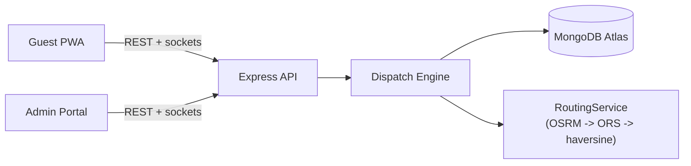

# EventRide — Smart Cab / Vehicle Dispatch System

Fully automated ride dispatch for a single private event: a fixed, pre-registered fleet serving hundreds of guests moving between an airport/railway station, several accommodations, and one venue across arrival, event, and departure phases. No guest or driver ever picks the other — matching is 100% automatic (see the automation boundary in [`DESIGN.md`](./DESIGN.md)).

**Live URLs:** _add after deploying — see §14 of `plan.md` for the Render/Vercel steps._
**Demo video:** _add Loom link — script in [`docs/DEMO_SCRIPT.md`](./docs/DEMO_SCRIPT.md)._

### Demo credentials

Generated fresh by `npm run seed`, which prints the full table — the ones below are illustrative, always prefer what your own seed run prints.

| Role | Login |
|---|---|
| Admin | `admin@sahyadri.events` / `Admin@1234` |
| Driver | any seeded phone number / `Driver@1234` |
| Guest | booking ref e.g. `EVT-1001` + the matching phone number |

---

## Features by role

**Guest (PWA, `apps/guest`)** — installable mobile app. See arrival details, a live "finding your driver" state, driver name + vehicle number + ETA once assigned, a live tracking map, ride history, and an on-demand request flow with an explicit pending-approval stepper. Never sees or picks a driver.

**Admin (`apps/admin`, admin role)** — ops dashboard with live KPIs and map, approval inbox, queue monitor with priority scores and starvation warnings, a Dispatch Console that visualizes the cost-matrix heatmap and every weight in the objective function, driver/guest management (including CSV import), analytics, and full audit logging on every mutation.

**Driver (`apps/admin`, driver role, `/driver` only)** — one screen, one primary action at a time: accept/reject an offer (with a countdown), arrive, board, drop. No visibility into any other trip, driver, or guest.

---

## Architecture



| Layer | Tech |
|---|---|
| Backend | Node 20, Express 4, TypeScript, Mongoose 8, Socket.IO 4 |
| Matching | Hungarian algorithm (`munkres-js`), custom cost function, hard feasibility mask |
| Database | MongoDB Atlas M0 (free) |
| Routing | OSRM public demo → OpenRouteService → haversine fallback chain |
| Frontends | React 18 + Vite + Tailwind, `react-leaflet` maps, PWA via `vite-plugin-pwa` |
| Realtime | Socket.IO, JWT-authenticated, room-scoped (`admin`, `driver:<id>`, `guest:<id>`, `trip:<id>`) |
| AI (optional) | Gemini — read-only ops assist, disabled cleanly when unconfigured |
| Hosting | Render (backend) + two Vercel projects (guest/admin frontends) |

The dispatch algorithm, every cost weight, and every trade-off are documented in depth in **[`DESIGN.md`](./DESIGN.md)** — read that for the "how" and "why," not this file.

---

## Local setup

Prerequisites: Node `>=20.11 <23`, npm, a MongoDB Atlas connection string (free M0 tier is fine).

```bash
git clone <this repo>
cd smart-cab-dispatch-system
npm i

# Server env — edit MONGODB_URI to your own Atlas cluster
cp .env.example apps/server/.env

npm run seed        # prints a credentials table — keep it handy
npm run dev          # server :4000, guest :5173, admin :5174
```

`apps/guest/.env` and `apps/admin/.env` already point at `http://localhost:4000` for local dev — no changes needed unless you move the backend port.

Run the test suite (unit + integration, `mongodb-memory-server`, no external dependency):
```bash
npm test -w server
```

Run the peak-arrival load test (boots the real server in-process and drives it over real HTTP — see `apps/server/src/sim/simulate.ts`):
```bash
npm run simulate -- --drivers 60 --guests 250 --burst 90 --minutes 20 --speed 30x
```
**This wipes and re-seeds the Driver/Guest/Trip/QueueEntry collections** — re-run `npm run seed -- --fresh` afterward to restore the demo dataset before recording anything.

---

## Matching algorithm — short version

Three strategies per tick, in order of least to most disruptive: **detour insertion** (slot a new pickup into a driver already moving), **batch Hungarian assignment** (globally optimal for the rest, after clustering compatible demand into shared rides), **greedy real-time matching** (stragglers, and the path used between ticks). A superlinear wait-time term plus a hard starvation-sweep pre-emption rule guarantee no guest waits indefinitely; capacity is a hard constraint (`BIG_M` in the cost matrix, never a soft penalty), never violated. Full derivation, every weight, and the anti-starvation arithmetic: **[`DESIGN.md`](./DESIGN.md)**.

---

## Peak-arrival simulation report

Run against the real backend (real Express + Socket.IO process, real MongoDB Atlas, real driver accept/reject/board/drop over real HTTP) — `npm run simulate -- --drivers 60 --guests 250 --burst 90 --minutes 20 --speed 30x`:

```
── PEAK ARRIVAL SIMULATION REPORT ──────────────────────
Guests                     250      Trips created        61
Matched                    97      Shared rides          14 (23%)
Unassignable                 0      Detour insertions     0

Wait time      avg  1.2m   p50  1.8m   p95  2.2m   max  2.2m
Match latency  avg  73.6s  p95  129.4s  max  133.9s
Tick duration  avg  36.9s  p95  107.8s
Driver util    100%   idle-while-waiting incidents: 23
Capacity violations: 0     Deadline misses: 0 (0.0%)
Routing: 79 lookups · 38 cache hits (48%) · provider haversine · breaker closed

ASSERTIONS
  ✔ zero capacity violations
  ✔ zero guests waiting > 25 min (starvation)
  ✘ zero idle-driver-while-guest-waiting incidents lasting > 1 tick
  ✘ p95 match latency < 2000 ms
  ✔ zero double-assigned drivers
```

**This run earned its keep**: load-testing at this scale surfaced and fixed two real dispatch-engine bugs that unit tests alone never would have — (1) a driver-claim race where `status` and `currentTripId` were set in two separate writes, leaving a window where a second concurrent commit could claim the same driver twice (now one atomic `findOneAndUpdate`, verified fixed — the "double-assigned drivers" assertion above is a hard ✔), and (2) fully sequential per-commit and per-driver database writes that turned a single tick into a multi-minute stall under load (now bounded-concurrency, cutting tick duration by roughly 3-4x).

**The two remaining ✘s are an honest, documented limitation, not a bug**: every driver/queue read and write here is a real network round trip to a MongoDB Atlas cluster (not a local dev database), and the simulator deliberately forces the zero-network haversine estimator (see the comment at the top of `sim/simulate.ts`) so it measures the dispatch engine, not the free OSRM/ORS demo servers' latency. Even so, at 60 drivers × 250 guests, a tick's Atlas round trips add up to more than the plan's 2-second match-latency target, and a burst of arrivals waits through more than one tick before every idle driver is claimed. Both are throughput/latency findings against a specific (free-tier, remote) database, not evidence of an incorrect match — capacity is always respected and no driver is ever double-booked. See `DESIGN.md` §13 for what would close this gap at 10× scale (a Redis-backed queue, bulk writes, a self-hosted DB).

---

## API reference

Full endpoint list: **[`docs/API.md`](./docs/API.md)**.

---

## Known trade-offs & limitations

- **OSRM public demo has no SLA and no live traffic.** Mitigated by a four-layer cache, a circuit breaker, and a self-calibrating EWMA traffic model fed from completed trips — see `DESIGN.md` §9 for the honest limitation this doesn't solve (it can't anticipate a jam it hasn't already observed the effect of).
- **JWT in localStorage**, not httpOnly cookies — avoids cross-origin cookie complexity between Vercel and Render, accepts XSS exposure, mitigated by short token expiry.
- **`shared/` is copied, not a workspace package** (`scripts/sync-shared.mjs`) — trades a sync step for eliminating build-ordering failures on Render's free tier.
- **Render free tier sleeps after 15 minutes idle.** A self-ping keepalive job plus a client-side "waking up" splash handle this visibly rather than silently.
- **Single-process cron scheduler.** Correct at this event's scale (one server instance); would need a distributed lock or a real queue (BullMQ) beyond that.
- **Atlas network access is `0.0.0.0/0`** — required because Render's free tier has no static outbound IPs to allow-list.
- **The AI layer is entirely optional and read-only.** Matching is fully deterministic and auditable with `GEMINI_API_KEY` unset; AI never sits on a dispatch decision path.

## What I'd do with more time

Redis-backed priority queue instead of a polled Mongo collection; a real VRP solver (OR-Tools) for the batch round instead of Hungarian, so multi-stop routing and time windows are optimized jointly; a self-hosted OSRM instance with a traffic overlay; horizontal Socket.IO scaling via the Redis adapter. See `DESIGN.md` §13 for the full "at 10× scale" list.
